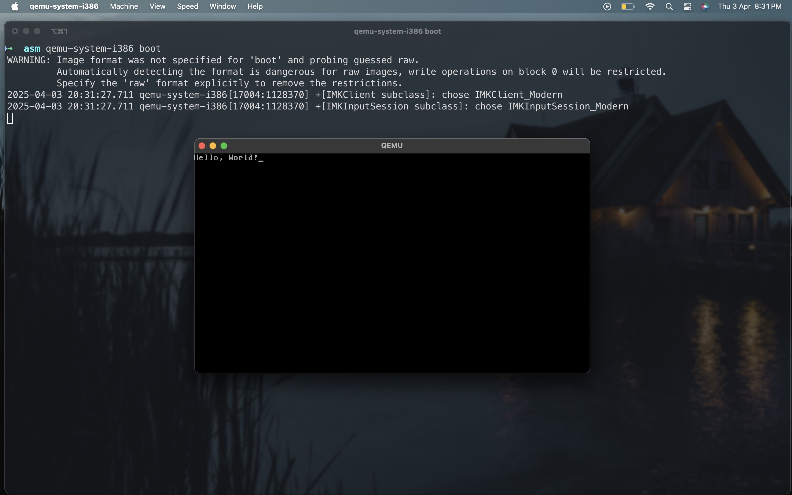

# Bootloader: Hello World

This is a simple bootloader written in x86 assembly that prints "Hello, World!" to the screen when booted using QEMU. The bootloader runs in 16-bit real mode and uses BIOS interrupts to print characters.

## Prerequisites
- NASM (Netwide Assembler)
- QEMU (Quick Emulator)

## Assembling the Code
To assemble the bootloader, run the following command:

```bash
nasm boot.asm -o boot
```

## Running the Bootloader
To run the bootloader using QEMU, execute the following command:

```bash
qemu-system-i386 boot
```

This will launch a QEMU virtual machine and display the message **"Hello, World!"** on the screen.

## Screenshots



## Explanation
The bootloader works by setting the video mode to 80x25 text mode and printing each character from the string using BIOS interrupts. The boot sector signature (0xAA55) at the end ensures that the BIOS recognizes it as a valid boot sector.

## Troubleshooting
- Make sure NASM and QEMU are installed and available in your system's PATH.
- If QEMU fails to run, check if the binary file is correctly generated.

Feel free to contribute or make improvements!

